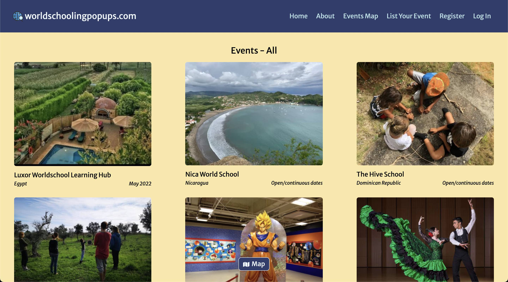
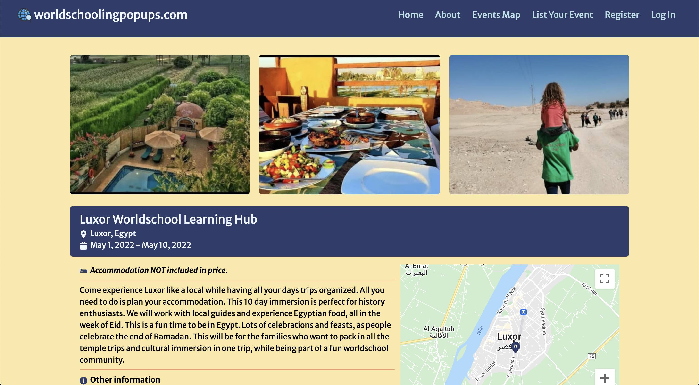
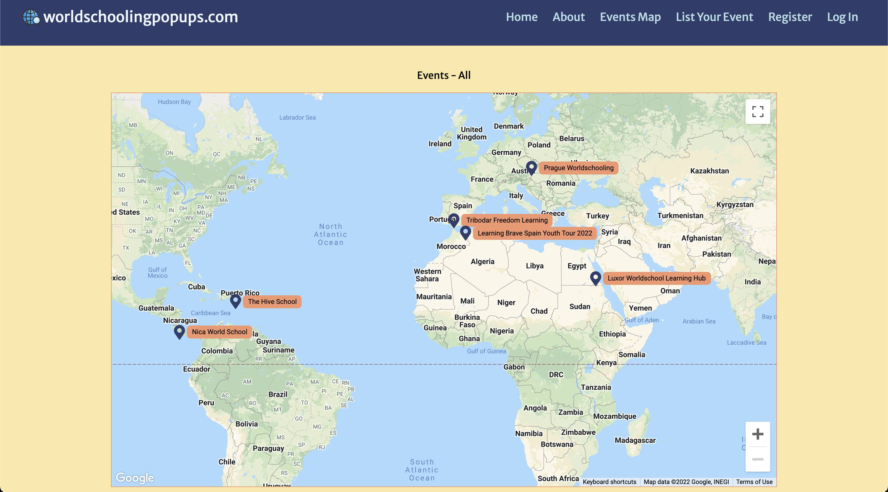
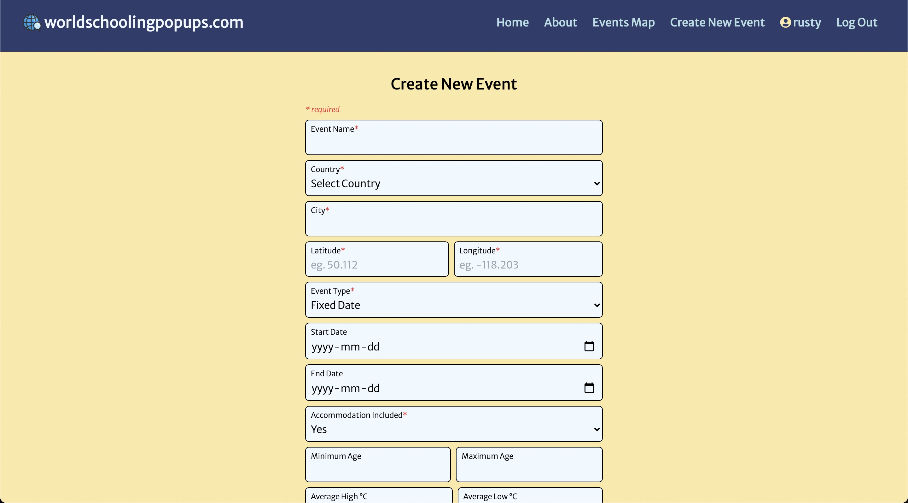

# *worldschoolingpopups.com* REST API - frontend

&nbsp;&nbsp;  

Date completed: March 3, 2022  

**Optimized for 📱 mobile and 🖥 desktop!**  

**See it live at (https://worldschoolingpopups.com)**  

**Backend repo (https://github.com/rusty-reebs/worldschoolingpopups)**

***Update**: April 30, 2022. Removed authentication from public-facing front-end. Built an authenticated admin front-end instead.*

Objectives: Build an Express REST API with JSON web token (`jwt`) authentication. The `jwt` is passed as a header cookie. All users have permission to browse the events, while only registered users may post new events. The frontend is written in React and uses conditional rendering, the Google Maps API, and the Cloudinary API for image handling.  

### TIL Things I Learned
----

- how to develop an Express REST API with `jwt` authentication.
- how to pass a token in the http header.
- gained a stronger understanding of Node `req`, `res`, and `next`.
- how to use the React `useContext` hook.
- some of the most challenging parts about this project were figuring out how to use the CORS middleware and http headers!

### Screenshots
----

  

  

  

  
